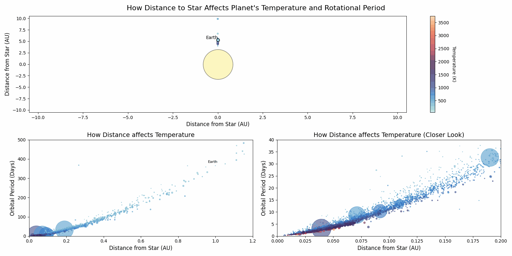
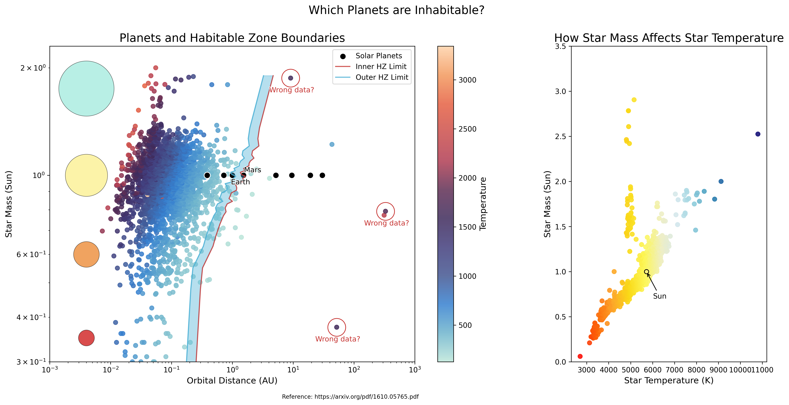

# Exoplanets Data Analysis and Visualization

<p align="center">
  
</p>

This repository contains a data analysis and visualization project developed as part of the **Data Visualization** course in the **Master of Science in Data Science** program at the **University of Luxembourg**.

The project focuses on exploratory analysis and visual storytelling using **exoplanet and solar system datasets**, combining static plots, animated visualizations, and interactive elements to study planetary properties, orbital behavior, and habitability indicators.

One of the visualizations produced in this project was later used by the **University of Luxembourg** to represent the **Data Science program** in official communication.

## Project Overview

The main goals of this project are:

- To explore exoplanet and solar system datasets using data-driven visualization
- To highlight relationships between planetary characteristics such as distance, temperature, and rotation period
- To design clear and engaging static and animated visualizations
- To demonstrate best practices in scientific visualization and exploratory data analysis

The analysis and visualizations are implemented primarily in a Jupyter Notebook.

## Key Visualizations

The project includes multiple visual outputs:

- Distribution and clustering of exoplanets
- Discovery trends over time and distance
- K-Means clustering of planetary features
- Animated visualization of planets orbiting a star
- Identification and visualization of habitable zones

<p align="center">
  
</p>

## Animation Notes

The **planet orbiting star animation** is computationally expensive.

To keep the repository lightweight and the notebook responsive:

- The default animation uses a reduced number of planets and frames
- Full-resolution animation parameters are documented in the notebook comments

Generating the full animation may take **30–40 minutes**, depending on hardware.

The animation is generated in code, saved to the `plots/` directory, and then displayed in a Markdown cell.  
If the animation does not render immediately inside the notebook, restarting the notebook interface usually resolves the issue.

## How to Run

1. Install dependencies:

```
pip install -r requirements.txt
```

2. Ensure the datasets are present in the `data/` directory.

3. Open and run:

```
main.ipynb
```

## Academic Context

- Course: Data Visualization
- Program: Master of Science in Data Science
- Institution: University of Luxembourg
- Year: 2024

This project was developed as part of coursework and is shared for educational and reference purposes.

## Author

Anton Zaitsev
